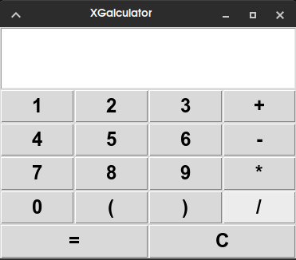

# XGalculator

<p align="center">
  
</p>

<p align="center">
  <b>A simple, lightweight GUI calculator made with Python and Tkinter.</b>
</p>

---

## ✨ Features

* ➕ Addition
* ➖ Subtraction
* ✖️ Multiplication
* ➗ Division
* 🔢 Decimal calculations
* `( )` Parentheses support
* 🧹 Clear button
* ⚡ Lightweight and fast
* 🐍 Written entirely in Python
* 🖥️ Simple graphical interface using Tkinter

## 📸 Screenshot


## 📦 Requirements

* Python 3
* Tkinter

The only Python dependency is `tkinter`.

### Debian / Ubuntu / MX Linux
```bash
pip install -r requirements.txt
```
or
```bash
pip install tkinter
```

## 🚀 Installation

Clone the repository:

```bash
git clone https://github.com/ABX532/XGalculator.git
cd XGalculator
```

Run XGalculator:

```bash
python3 main.py
```

That's it — no virtual environment or additional Python packages are required.

## 🧮 Usage

Enter an expression using the calculator buttons.

Examples:

```text
2 + 2
10 * 5
100 / 4
(10 + 5) * 2
```

Press `=` to calculate the result.

Press `C` to clear the current calculation.

## 📁 Project Structure

```text
XGalculator/
├── main.py
├── requirements
├── xgalculator.png
├── LICENSE
└── README.md
```

## 🛠️ Built With

* **Python**
* **Tkinter**

The calculator uses Python's built-in `eval()` to evaluate the entered mathematical expression.

## 📄 License

XGalculator is licensed under the **GNU General Public License v3.0**.

See [`LICENSE`](LICENSE) for the full license text.

## 🤝 Contributing

Contributions, improvements, and bug reports are welcome!

1. Fork the repository
2. Create a new branch
3. Make your changes
4. Commit your changes
5. Open a Pull Request

## ⭐ Support

If you find XGalculator useful, consider giving the repository a ⭐ on GitHub!

**Repository:** https://github.com/ABX532/XGalculator

Made with ❤️ By ABX
